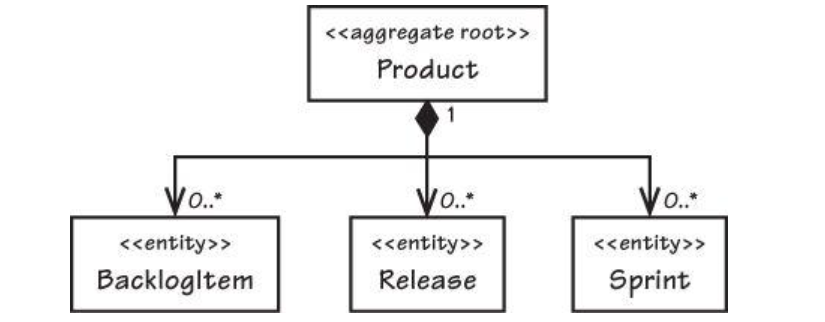
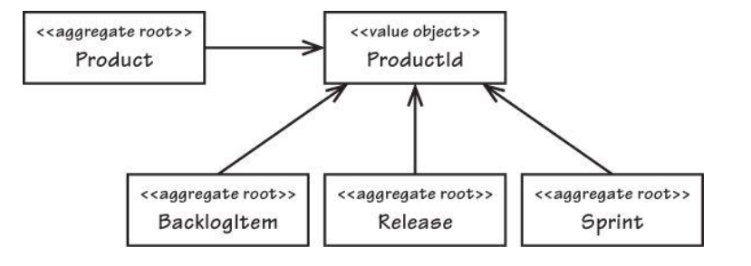
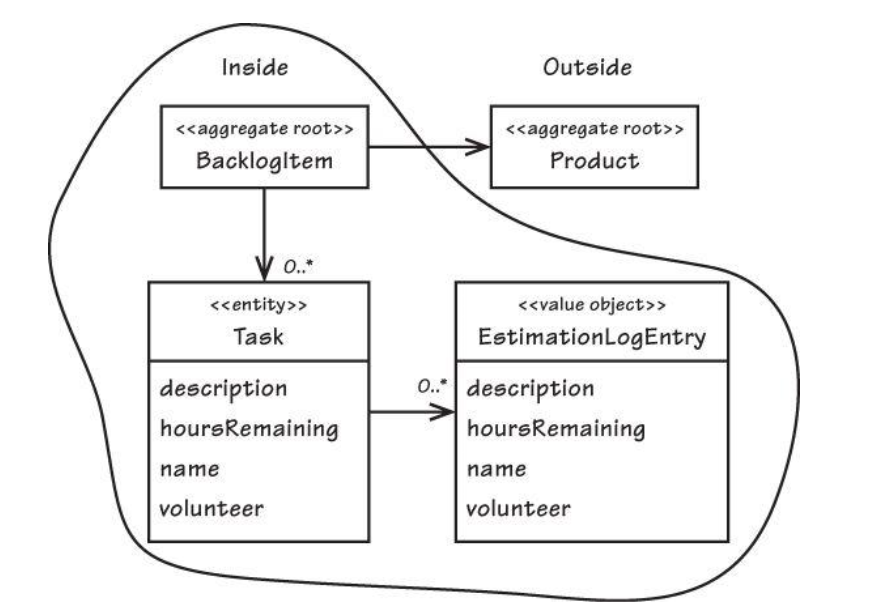
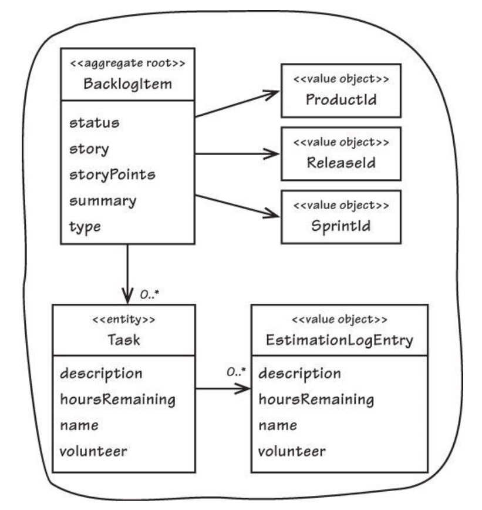
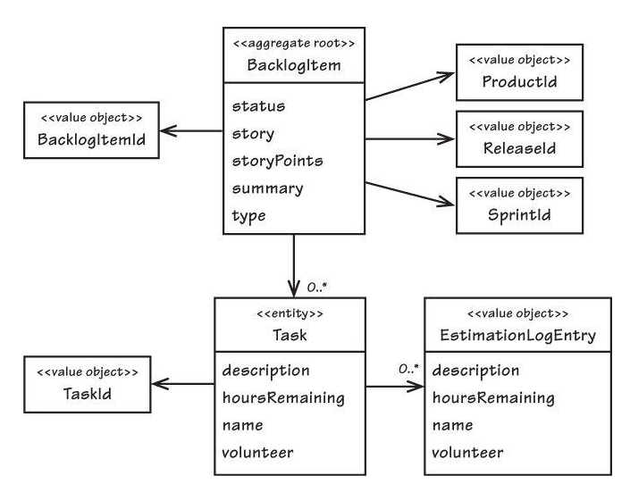

# Chapter 10 Aggregates

Clustering Entities and Value Objects into an Aggregate with a carefully crafted consistency boundary. The Aggregate pattern discusses composition and alludes to information hiding.

## Chapter Learning content
* experience negative consequences of bad aggregate design
* learn aggregate rules of thumb
* consider advantages of small aggregates
* see why you should reference aggregates by identifier
* discover advantes of eventual consistency
* learn aggregate implementation techniques


## Bad aggregate design by example
In the book the example of the agile context is described. The core domain is scrum. The bounded context is **Agile Project Management Context** the application named ProjectOvation. The team started with the following statements of the ubiquitous language:
* Products have backlog items, releases, and sprints.
* New product backlog items are planned.
* New product releases are scheduled.
* New product sprints are scheduled.
* A planned backlog item may be scheduled for release.
* A scheduled backlog item may be committed to a sprint.

### First attempt
The team has focused on the word Product for their aggregate design. So the first attempt was a large Product aggregate:
```java
public class Product extends ConcurrencySafeEntity  {
    private Set<BacklogItem> backlogItems;
    private String description;
    private String name;
    private ProductId productId;
    private Set<Release> releases;
    private Set<Sprint> sprints;
    private TenantId tenantId;
}
```


The big aggreate was not practical because of transactional failures in the multi-user system. The commit fails because every entity has its own version. If two users work with one version and a third user updates the version, the commit will be rejected. So this is not working. Problem is also artificial constraints imposed by the developer. So a creation of a new backlog item corresponding with Sprint, which is not the sense of the business model.

### second attempt

The second attempt consists of four distinct Aggregates. Each of the dependency is associated by inference using a common ProductId



The new code looks like:
```java
public class Product {
    
    public BacklogItem planBacklogItem(
        String aSummary, String aCategory,
        BacklogItemType aType, StoryPoints aStoryPoints) {
            //plan
    }

    public Release scheduleRelease(
        String aName, String aDescription,
        Date aBegins, Date anEnds) {
        //schedule release
    }

    public Sprint scheduleSprint(
        String aName, String aGoals,
        Date aBegins, Date anEnds) {
        //schedule sprint
    }
}
```

All methods have a CQS query contract and act as Factories. If an application service wants to create a BacklogItem it can do it this way:

```java
public class ProductBacklogItemService {
    
    @Transactional
    public void planProductBacklogItem(
        String aTenantId, String aProductId,
        String aSummary, String aCategory,
        String aBacklogItemType,
        String aStoryPoints) {

        Product product =
            productRepository.productOfId(
                    new TenantId(aTenantId),
                    new ProductId(aProductId));

        BacklogItem plannedBacklogItem =
            product.planBacklogItem(
                    aSummary,
                    aCategory,
                    BacklogItemType.valueOf(aBacklogItemType),
                    StoryPoints.valueOf(aStoryPoints));

        backlogItemRepository.add(plannedBacklogItem);
    }
}
```
We solved the transactional failures by modelling it away. You can simultaneous create backlog items.

**RULE: Model True Invariant in Consistency Boundaries**

### invariants
An invariant is a business rule that must always be consistent. Two kinds of consistency:
* transactional consistency -> immediate and atomic
* eventual consistency 

An invariant can be:
c = a + b

We would model this as a consistent boundary that the rule is always true. The consistency of everything outside the boundary is irrelevant to the aggregate. So **Aggregate is synonymous with transactional consistency boundary**.
A properly designed Aggregate is one that can be modified in any way required by the business with its invariants completely consistent within a single transaction. 

**LEARNING: We cannot correctly reason on Aggregate design without applying transactional analysis.**

Aggregates are chiefly about consistency boundaries and not driven by a desire to design object graphs.

## **Rule: Design Small Aggregates**
If we have to large Aggregates we will have problems with guarantee that all transactions would succeed and it limits performance. If we start with a large aggregate we will face a lot of problems later if the model grows. So don´t do this.

**How to find right size for Aggregates?**

Normally you should design an aggregate with a root entity and some value objects. In the evans book there is an example where it makes sense to use multiple entities. A purchase order is assigned a maximum allowable total, and the sum of all line items must not surpass the total. This rule is tricky to enforce if it´s not in the same aggregate.

## **Rule: Reference Other Aggregates by Identity**
When designing Aggregates, we may desire a compositional structure that allows for traversal through deep object graphs, but that is not the motivation of the pattern. However, we must keep in mind that this does not place the referenced Aggregate inside the consistency boundary of the one referencing it. See the following picture. The Product is still outside the Backlog Aggregate.



The code looks like:
```java
public class BacklogItem extends ConcurrencySafeEntity  {
     ...
    private Product product;
    ...
}
```
With this implementation we have the following implications:
* Both the referencing Aggregate (BacklogItem) and the referenced Aggregate (Product) must not be modified in the same transaction. Only one or the other may be modified in a single transaction.
* If you are modifying multiple instances in a single transaction, it may be a strong indication that your consistency boundaries are wrong. If so, it is possibly a missed modeling opportunity; a concept of your Ubiquitous Language has not yet been discovered 
* If you are attempting to previous point, and doing so influences a large-cluster Aggregate with all the previously stated caveats, it may be an indication that you need to use eventual consistency (see later in this chapter) instead of atomic consistency.

We can´t modify another aggregate if we hold any reference. So **Making Aggregates Work Together through Identity References**



The new code looks like:
```java
public class BacklogItem extends ConcurrencySafeEntity  {
    ...
    private ProductId productId;
    ...
}
```
advantages:
* aggregates are smaller
* model can perform better 
* need less memory

If you use references, you also need navigation through the model. This should be done by a Repository or Domain Service to to lookup dependend objects.
```java
public class ProductBacklogItemService ... {
    ...
    @Transactional
    public void assignTeamMemberToTask(String aTenantId,
        String aBacklogItemId,
        String aTaskId,
        String aTeamMemberId) {

        BacklogItem backlogItem =
            backlogItemRepository.backlogItemOfId(
                new TenantId(aTenantId),
                new BacklogItemId(aBacklogItemId));

        Team ofTeam =
            teamRepository.teamOfId(
                backlogItem.tenantId(),backlogItem.teamId());

        backlogItem.assignTeamMemberToTask(
                new TeamMemberId(aTeamMemberId),
                ofTeam,
                new TaskId(aTaskId));
    }
    ...
}
```
Limiting a model to using only reference by identity could make it more difficult to serve clients that assemle and render User Interface views. If the query overhead causes performance it may be worth to considering CQRS.


## **Rule: Use Eventual Consistency Outside the Boundary**
"Any rule that spans AGGREGATES will not be expected to be up-to-date at all times. Through event processing, batch processing, or other update mechanisms, other dependencies can be resolved within some specific time." [Evans, p. 128]

Convince the domain expert that eventual consistency is ok for your model. So some objects can be out of sync for some minutes, hours. There is a practical way to support eventual consistency in a DDD model:

```java
public class BacklogItem extends ConcurrencySafeEntity  {

    public void commitTo(Sprint aSprint) {

        DomainEventPublisher
            .instance()
            .publish(new BacklogItemCommitted(
                    this.tenantId(),
                    this.backlogItemId(),
                    this.sprintId()));
    }
}
```
The event ```BacklogItemCommitted``` is delivered to one ore more subscribers. Each subscriber retrieves a different yet corresponding Aggregate instance. Each subscriber executes in a separate transaction. If a transaction fails the modification can do a retry until it works or the max amount of retries is reached. This demonstrates the use of eventual consistency in a single Bounded Context. You can use it in distributed fashion.

### When to use eventual consistency vs. transactional
The users of classical/traditional ddd way tend to use transaction. The users of CQRS may lean to use eventual consistency. To decide it you need to ask if it is the job of the user executing the use case to make the data consistent. If it is, try to make it transactionally consistent, but only by adhering to the other rules of Aggregates. It it is anothers users job or the job of the system, allow it to be eventually consistent. It helps us to understand our domain.

## When to break the rules?

### Reason One: User Interface Convenience
If the UI allows the user to create multiple items in batch mode. An example is the creation of multiple backlog items. 

### Reason Two: Lack of Technical Mechanisms
Eventual consistency requires messaging, times or background threads. If you are working on a project which does not support some kind of mechanism you are forced to modify multiple aggregates or using large-cluster Aggregates. 

### Reason Three: Global Transactions
If legacy technologies and enterprice policies force you to have global, two-phase commit transactions. But even then you don´t need to update multiple Aggregates in your BC.

### Reason Four: Query Performance
Sometimes it helps you to hold complete reference of other Aggregates. It helps to speed up your repository read.


## Rethinking Design
We want to rethink the design of the scrum example and use our Aggreate rules. We have the BacklogItem Aggregate:



The BacklogItem is refrenced by ```Product```, the ```Release``` and the ```Sprint```. It seems fairly small. Open question if the ```Task``` should be an own aggregate. To find the answer we need the ubiquitous language. Follwing statements are interesting:
* When progress is made on a backlog item task, the team member will estimate task hours remaining.
* When a team member estimates that zero hours are remaining on a specific task, the backlog item checks all tasks for any remaining hours. If no hours remain on any tasks, the backlog item status is automatically changed to done.
* When a team member estimates that one or more hours are remaining on a specific task and the backlog item’s status is already done, the status is automatically regressed.

It sounds like it is a true invariant. But we want more criterias to decide.

### Estimating Aggregate Cost
We should guess how many ```Tasks``` or ```EstimationLogEntry``` instances we will need. A back-of-the-envelope calculation can help. There are some calculation examples in the text. So the text has calculated 144 total collected objects per backlog items. With this amount the team will make some performance tests to verify the model.

### Common Usage Scenarios
You need to identify common usage scenarios. How often will the user load all 144 objects into memory at once? If not whats the high end count? If the developers learned that multiple users do indeed regularly want to add tasks together, it would change the analysis significantly. That understanding could immediately tip the scales in favor of breaking BacklogItem and Task into two separate Aggregates.
**Result:** Even if they altered the usage scenarios, accelerating task completion by double (six days) or even mixing it up completely, it wouldn’t change anything. It’s always the final estimate that transitions the status, which modifies the Root. This seemed like a safe design, although memory overhead was still in question.

### Memory Consumption
What about the total number of tasks and estimates in memory for each reestimation? In the end the Aggregate design requires one backlog item, 12 tasks, and 12 log entries, or 25 objects maximum total. Will this design cause performance problems because of lazy loads? Possibly, because it actually requires two lazy loads, one for the tasks and one for the estimation log entries for one of the tasks. The team is still not sure if it works with the model.

### Exploring Another Alternative Design
The teams wants to try another design:


The ```Task``` is separated from ```BacklogItem``` and each is an aggregate. We try to use eventual consistency between both aggregates. When a ```Task``` processes an ```estimateHoursRemaining()``` command, it publishes a Domain Event. 

```java
public class TaskHoursRemainingEstimated implements DomainEvent {
    private Date occurredOn;
    private TenantId tenantId;
    private BacklogItemId backlogItemId;
    private TaskId taskId;
    private int hoursRemaining;
}
```

The subscriber of this event has 
* the ```BacklogItemRepository``` to retrive the identified ```BacklogItem``` 
* the ```TaskRepository``` to retrieve the corresponding ```Task```
it executes the ```BacklogItem``` Command named ```estimateTaskHoursRemaining()```, pasing the hoursRemaining and corresponding tasks. To optmize this behaviour you could the database calculate the sum instead of getting all Tasks. 

Eventual consistency complicates the UI. A user does not get the current state, so it could be confusing. To solve this you could implement a polling mechanism or inform the user to check later. 

### Is it the Team Members Job?
Whose job is it to bring a backlog item’s status into consistency with all remaining task hours? Do team members using Scrum care if the parent backlog item’s status transitions to done just as they set the last task’s hours to zero? What if there is another project stakeholder involved? Maybe someone wants to use the feature on a continuous integration server first. Leaving tasks within their backlog item solves the consistency problem, and it’s a modeling choice that can support both automatic and manual status transitions.

### Conclusion
The option to split it in two remained in their hip pocket just in case. After further experimentation with the current design, running it through performance and load tests, as well investigating user acceptance with an eventually consistent status, it will become clearer which approach is better. The BOTE numbers could prove to be wrong if in production the Aggregate is larger than imagined. If so, the team will no doubt split it into two.


## Implementation of Product Aggregate
```java
public class TaskHoursRemainingEstimated implements DomainEvent {
    public class Product extends ConcurrencySafeEntity  {
    private Set<ProductBacklogItem> backlogItems;
    private String description;
    private String name;
    private ProductDiscussion productDiscussion;
    private ProductId productId;
    private TenantId tenantId;
}
}
```
Class ConcurrencySafeEntity is a [Layer Supertype](https://www.sitepoint.com/the-layer-supertype-pattern-encapsulating-common-implementation-in-multi-tiered-systems/). Each Root must be designed with a globally unique identity. The Product has been modeled with a Value type named ProductId. The implementation of ```ProductRepository``` has ```nextIdentity()``` method.
```java
public class HibernateProductRepository implements ProductRepository  {
    public ProductId nextIdentity() {
        return new ProductId(java.util.UUID.randomUUID().toString().toUpperCase());
    }
}
```
A client Application Service can instantiate a Product with globally unique identity:
```java
public class ProductService {
   @Transactional
   public String newProduct(
        String aTenantId, aProductName, aProductDescription) {
        Product product =
            new Product(
                new TenantId(aTenantId),
                this.productRepository.nextIdentity(),
                "My Product",
                "This is the description of my product.",
                new ProductDiscussion(
                        new DiscussionDescriptor(
                            DiscussionDescriptor.UNDEFINED_ID),
                        DiscussionAvailability.NOT_REQUESTED));

        this.productRepository.add(product);

        return product.productId().id();
    }
}
```
Choose to model a contained Aggregate part as a Value Object rather than an Entity whenever possible. Our current Product model is designed with two simple attributes and three Value-typed properties. Both ```description``` and ```name``` are String attributes that can be completely replaced. The ```productId``` and ```tenantId``` Values are maintained as stable identities; that is, they are never changed after construction. They support reference by identity rather than direct to object. In fact, the referenced ```Tenant``` Aggregate is not even in the same Bounded Context and thus should be referenced only by identity. The ```productDiscussion``` is an eventually consistent Value-typed property.

### Law of Demeter
This guideline emphasizes the principle of least knowledge. Think of a client and server pattern. The client should not need to know the inner details to execute a command on the server. Here’s a basic summary of the Law of Demeter: Any given method on any object may invoke methods only on the following: (1) itself, (2) any parameters passed to it, (3) any object it instantiates, (4) self-contained part objects that it can directly access.

### Tell Don´t Ask
This guideline simply asserts that objects should be told what to do. A client object should not ask a server object for its contained parts, then make a decision based on the state it got, and then make the server object do something. The client should “Tell” a server what to do, using a command on the server’s public interface.

Apply this guidelines on Product Aggregate: 
```java
public class Product extends ConcurrencySafeEntity  {
    public void reorderFrom(BacklogItemId anId, int anOrdering) {
        for (ProductBacklogItem pbi : this.backlogItems()) {
            pbi.reorderFrom(anId, anOrdering);
        }
    }

    public Set<ProductBacklogItem> backlogItems() {
        return this.backlogItems;
    }
}
```
The ```reorderFrom()``` method uses its internal ```BacklogItems``` to modify. You will need to weigh the competing forces between use of Law of Demeter and Tell, Don’t Ask. Certainly the Law of Demeter approach is much more restrictive, disallowing all navigation into Aggregate parts beyond the Root. 

### Optimistic Concurrency 
Next, we need to consider where to place the optimistic concurrency version attribute. ```Product``` would have a version attribute, and when any of its ```describeAs(), initiateDiscussion(), rename(), or reorderFrom() ``` command methods are executed, the version would always be incremented.
```java
public class Product extends ConcurrencySafeEntity  {
    public void reorderFrom(BacklogItemId anId, int anOrdering) {
        for (ProductBacklogItem pbi : this.backlogItems()) {
            pbi.reorderFrom(anId, anOrdering);
        }
        this.version(this.version() + 1);
    }
}
```
One problem is that this code always dirties the Product, even when a reordering command actually has no effect. It’s possible that we don’t need to modify the Root’s version when any backlogItems are modified. Versioning all Entity parts doesn’t work in every case.  Sometimes the only way to protect an invariant is to modify the Root version. 

### Avoid Dependency Injection
Dependency injection of a Repository or Domain Service into an Aggregate should generally be viewed as harmful. The motivation may be to look up a dependent object instance from inside the Aggregate. As stated earlier under “Rule: Reference Other Aggregates by Identity,” preferably dependent objects are looked up before an Aggregate command method is invoked, and passed in to it.

## Wrap-Up
* You experienced the negative consequences of modeling large-cluster Aggregates.
* You learned to model true invariants in consistency boundaries.
* You considered the advantages of designing small Aggregates.
* You now know why you should favor referencing other Aggregates by identity.
* You discovered the importance of using eventual consistency outside the Aggregate boundary.
* You saw various implementation techniques, including how you might use Tell, Don’t Ask and Law of Demeter.