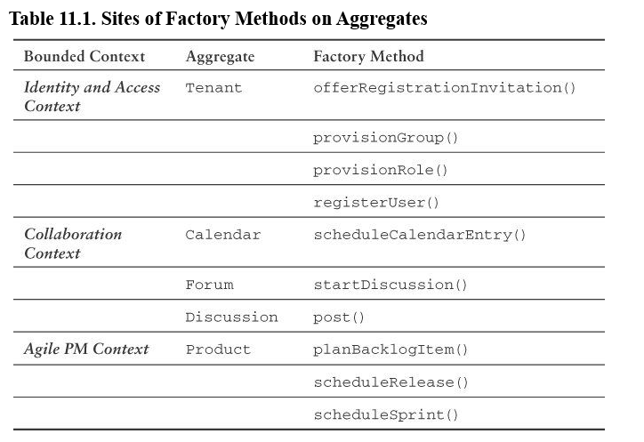

# Chapter 11 Factories

 The focus here is to provide examples of how you can use Factories in the domain model.

## Chapter Learning content
* Learn why the use of Factories can produce expressive models that adhere to the Ubiquitous Language (1).
* See how SaaSOvation uses Factory Methods as Aggregate (10) behaviors.
* Consider how to use Factory Methods to create Aggregate instances of other types.
* Learn how Domain Services can be designed as Factories while interacting with other Bounded Contexts (2) and translating foreign objects to local types.

## Factories in Domain Model

Primary Motivation: Shift the responsibility for creating instances of complex objects and AGGREGATES to a separate object. This is not part of the domain model but of the domain design. A factory which only creates new elements is not a first class citizen in the domain model. But an aggregate root which provides a Factory Method for producing instances of another Aggregate type is part of the model.

Factory Methods allow you to expresss the Ubiquitous Language in ways not possible through constructors alone. Sometimes you need complex constructions. These situations occur when integrating bounded contexts. In this situations services functions as factories producing Aggregates or ValueObjects of various types.



Example Usage of Calendar Factory

```java
public class CalendarTest extends DomainTest {
    private CalendarEntry calendarEntry;
    private CalendarEntryId calendarEntryId;
    public void testCreateCalendarEntry() throws Exception {

        Calendar calendar = this.calendarFixture();

        DomainRegistry.calendarRepository().add(calendar);

        DomainEventPublisher
            .instance()
            .subscribe(
                new DomainEventSubscriber<CalendarEntryScheduled>() {
                public void handleEvent(
                        CalendarEntryScheduled aDomainEvent) {
                    calendarEntryId = aDomainEvent.calendarEntryId();
                }
                public Class<CalendarEntryScheduled>
                        subscribedToEventType() {
                            return CalendarEntryScheduled.class;
                }
            });

        calendarEntry =
            calendar.scheduleCalendarEntry(
                    DomainRegistry
                        .calendarEntryRepository()
                        .nextIdentity()
                    new Owner(
                        "jdoe",
                        "John Doe",
                        "jdoe@lastnamedoe.org"),
                    "Sprint Planning",
                    "Plan sprint for first half of April 2012.",
                    this.tomorrowOneHourTimeSpanFixture(),
                    this.oneHourBeforeAlarmFixture(),
                    this.weeklyRepetitionFixture(),
                    "Team Room",
                    new TreeSet<Invitee>(0));

        DomainRegistry.calendarEntryRepository().add(calendarEntry);

        assertNotNull(calendarEntryId);
        assertNotNull(calendarEntry);
    }
}
```

Factory Method:
```java
public class Calendar extends Entity  {
    ...
    public CalendarEntry scheduleCalendarEntry(
            CalendarEntryId aCalendarEntryId,
            Owner anOwner,
            String aSubject,
            String aDescription,
            TimeSpan aTimeSpan,
            Alarm anAlarm,
            Repetition aRepetition,
            String aLocation,
            Set<Invitee> anInvitees) {
        CalendarEntry calendarEntry =
            new CalendarEntry(
                    this.tenant(),
                    this.calendarId(),
                    aCalendarEntryId,
                    anOwner,
                    aSubject,
                    aDescription,
                    aTimeSpan,
                    anAlarm,
                    aRepetition,
                    aLocation,
                    anInvitees);

        DomainEventPublisher
            .instance()
            .publish(new CalendarEntryScheduled(...));

        return calendarEntry;
    }
}
```

You may note the lack of guards at the top of this method. The guards should be in the entiy, so you can only construct valid objects.

Two of the nine parameters are provided by the Factory Method itself. The Tenant and CalenderId is only provided by the creator. This is where we guarantee that CalendarEntry instances are created only for the correct Tenant and in association with the correct Calendar.

## Discussion Instances

```java
public class Forum extends Entity  {

    public Discussion startDiscussion(
            DiscussionId aDiscussionId,
            Author anAuthor,
            String aSubject) {
        if (this.isClosed()) {
            throw new IllegalStateException("Forum is closed.");
        }
        Discussion discussion = new Discussion(
                this.tenant(),
                this.forumId(),
                aDiscussionId,
                anAuthor,
                aSubject);

        DomainEventPublisher
            .instance()
            .publish(new DiscussionStarted(...));

        return discussion;
    }
}
```

Three of the five parameters must be supplied by the client. The factory method expresses the Ubiquitous Language: 

_Authors start discussions on forums_

Factory Methods on Aggregates can be used to express the Language and reduce the burden on clients when creating new Aggregate instances. It also ensures instantiations with correct state.

## Factory on Service
Use Services as factories in Integrating Bounded Contexts. 

It’s a Factory in the form of CollaboratorService, producing Collaborator instances from tenant and user identity:
```java
public interface CollaboratorService  {

    public Author authorFrom(Tenant aTenant, String anIdentity);

    public Creator creatorFrom(Tenant aTenant, String anIdentity);

    public Moderator moderatorFrom(Tenant aTenant, String anIdentity);

    public Owner ownerFrom(Tenant aTenant, String anIdentity);

    public Participant participantFrom(
            Tenant aTenant,
            String anIdentity);
}
```

This Service provides object translation from the Identity and Access Context to the Collaboration Context.

```java
public class UserRoleToCollaboratorService
        implements CollaboratorService {

    public UserRoleToCollaboratorService() {
        super();
    }

    @Override
    public Author authorFrom(Tenant aTenant, String anIdentity) {
        return
            (Author)
                UserInRoleAdapter
                    .newInstance()
                    .toCollaborator(
                            aTenant,
                            anIdentity,
                            "Author",
                            Author.class);
    }
}
```
The implementation hitches to the UserInRoleAdapter to morph a Tenant and an identity—the user’s username—into an instance of class Author.
This Adapter interacts with the Open Host Service of the Identity and Access Context to confirm that the given user is in the role named Author. The Author is a simple ValueObject.

## Wrap-Up
* You understand the use of factories can produce expressive models
* You’ve seen two different Factory Methods implemented as Aggregate behaviors
* Use Factory Methods to create Aggregate instances of other types, all while ensuring the correct production and use of sensitive data.
* You also learned how Domain Services can be designed as Factories, even interacting with other Bounded Contexts and translating foreign objects to local types.