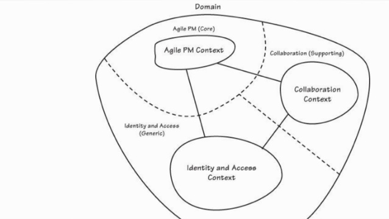
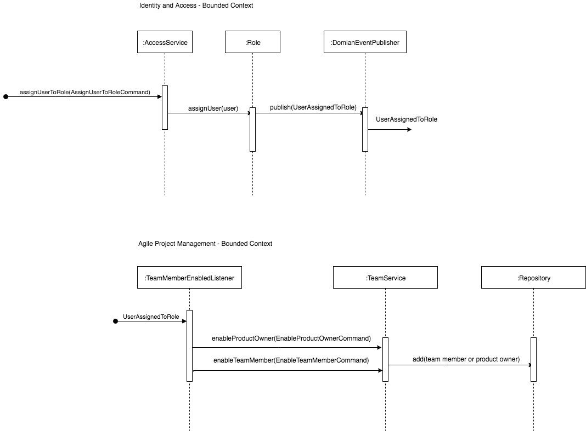
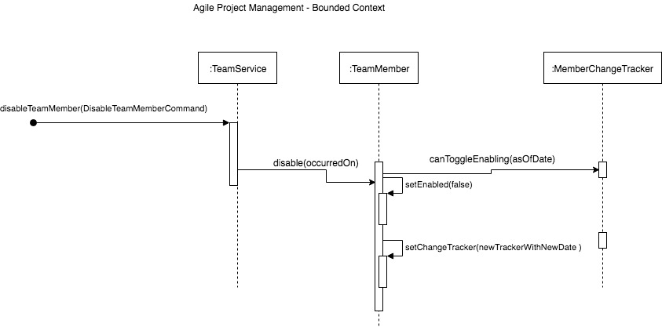

# Chapter 13 Integrating Bounded Contexts

Summary of Integrating Bounded Contexts chapter.

## Integration Basics

When one Bounded Context (BC) needs to integrate with another BC, options are:

* BC-A -----RPC-API----> BC-B
    * RPC-API: made using procedures that take parameters
    
* BC-A -----Messaging(Publish-Subscribe)----> BC-B

* BC-A -----RESTFul HTTP----> BC-B
    * RESTFul HTTP: exchange and modify resources using URIs

## Principles of Distributed Computing

* Network is <b>not reliable</b>. 
* There is always <b>short/long latency </b>.
* <b>Bandwidth</b> is not infinite.??
* The network is not always <b>secure</b>.
* Network <b>topology changes</b>.
* Knowledge and policies are spread across  <b>multiple administrators</b>.
* Network transport has <b>cost</b>.
* The network is <b>heterogeneous</b>.

## Exchange Information Across System Boundaries

- Using a set of common classes and interfaces [M]<br>
System-A [M] ---> exchangeable information structure --> [M] System-B

- Using a standards based approach where no shared classes/interfaces are needed<br>
System-A --- exchangeable information structure --> System-B

* Exchangeable Information Structure
    * should be of a format that is transferable across the wire
    * should be usable by the consuming system
    * without the use of interfaces and classes
    
Example: Notification -> Event
```json
{
  "notificationId": 11111,
  "typeName": "com.compnay.app.SomeEvent",
  "version": 123,
  "occurredOn": "some date/time format",
  "event": {
     "eventType": "com.compnay.app.SomeEvent",
     "eventVersion": "123",
     "occurredOn": "some date/time format",
     "businessEventId": "456",
     "backlogItemId": "456",
     "sprintId": "789",
     "tenantId": "135",
     "eventField1": "abc",
     "eventField2": "efg",
     "eventField3": "xyz"
  }
}
```

* we can see that root level fields are standard end hence can provide 
type-safe methods for these fields: notificationId,typeName,version,occurredOn

* special event details can be read like so:

```
    //the producer creates and packages the domain-event
    DomainEvent domainEvent = new DomainEvent(100, "testing");
    Notification notification = new Notifiction(1, domainEvent);
    NotificationSerializer serializer = NotificationSerializer.instance();
    
    //this is what is sent across the wire
    String serializedNotificatin = serializer.serialize(notification);
    
    //once recieved on the consumer side
    NotificationReader reader = NotificationReader(serializedNotificatin);
    
    //standard fields
    reader.notificationId();
    reader.typeName();
    reader.version();
    reader.occurredOn();
    
    //speacial event fields
    reader.eventStringValue("eventVersion");
    reader.eventStringValue("/eventVersion");//using slash
    reader.eventIntegerValue("eventVersion");//using type-safe method
    
    reader.eventStringValue("nestedEvent", "eventVersion");
    reader.eventStringValue("nestedEvent/eventVersion");
    reader.eventIntegerValue("nestedEvent", "eventVersion");
    reader.eventIntegerValue("nestedEvent/eventVersion");
        
    reader.eventStringValue("<fieldName>");
    reader.eventStringValue("<nestedEvent>","<fieldName>");
    reader.eventStringValue("<nestedEvent>/<fieldName>");
    
    //events can also hold Value Objects
    reader.eventStringValue("backlogItemId.id");
    reader.eventStringValue("sprintId.id");
    reader.eventStringValue("tenantId.id");
   
```

* Here it can be seen that the notification and event have version numbers.
* Consumers can look for specific versions of notification/event to consume or 
* With careful consideration it is possible that consumers read event fields in the same way even when event structure changes.
* Using this approach consumers can still process older versions of these notification.
* Protocol Buffers: can be a better option when events change more frequently.

## Integration Using RESTful Resources
* Open Host Service
    * Client ---> URIs ---> BC[restful resources]
    * A set of open services: HTTP methods[GET,PUT,POST,DELETE] operate on resources

* Autonomy
    * Client can't carry out required integration if RESTFul-BC is unavailable.
    * Can create the illusion of decoupling
        * Timers: client will reach out to remote systems when timer elapses.
        * Messaging: or when a message is received.
        * If the remote system is unavailable timer threshold can be backed-off or message can be 
        negatively acknowledged.
        
* <u><b>Shared Kernel</b> and <b>Conformist</b> context mapping relationships should be avoided in DDD as they run 
counter the goals of DDD.</u>
    * To avoid these relationships think of the the specific integration use-case and expose only what is needed. 

* Hexagonal Architecture
    * UserResource<HTTP Resource> --> AccessService<Application Service>
    * Application Services are direct clients of the inner-hexagon i.e. the Domain!
        * They are from the solution space not problem space.
    * Domain Services are from the Domain ubiquitous language i.e. from the problem space.
        * Is used by application-service and aggregates.
        
## Implementing the REST Client Using an Anticorruption Layer
* <client>BC-[ACL] -----> BC
* protect a client BC domain from pollution caused by another server BC
* convert foreign concepts to more effective local concepts
* [BC: Identity and Access]: local concepts: User, Role
* [BC:Collaboration]: local concepts: Collaborator
* [BC:Collaboration][ACL] --------<-REST[user,role]--------> [BC: Identity and Access]
* [ACL] classes: TranslatingCollaboratorService<CollaboratorService> -> UserInRoleAdapter -> CollaboratorTranslator
    * CollaboratorService: a facade that hides away the complexity of getting a Collaborator from foreign BC
        * The interface CollaboratorService is in the domain model
        * But the implementation TranslatingCollaboratorService is the infrastructure as a technical concern
    * UserInRoleAdapter: makes the remote call to get json
    * CollaboratorTranslator: convert json to Collaborator class

## Integration Using Messaging
* allows any one system to achieve a higher degree of autonomy from systems it depends on.
* as long as the middleware messaging system is running messages can still be produced and consumed even when not all 
systems are running.
* BoundedContext <--- Domain Events ----> BoundedContext



* When in the <b>[Identity and Access Context-BC]</b> a User is assigned a role, the Role class produces an Event so that 
the <b>[Agile Project Management-BC]</b> can establish TeamMember or ProductOwner entity.

* One problem that could occur when using messaging is that Events can be delivered in the wrong order. In this case 
you can use the occurredOn field to ensure Events are applied in the correct order.

* You can use the XXXXChangeTracker with date field for each field in the Entity.

* The tracker also serves to make the Entity idempotent. 


```java
public final class MemberChangeTracker implements Serializable {
    private Date emailAddressChangedOn;
    private Date enabledOn;
    private Date nameChangedOn;
    //...
    public booelan canToggleEnabling(Date asDate) {
        return this.enabledOn().before(asDate);
    }
    //...
    public MemberChangedTracker enablingOn(Date asDate) {
        return new MemberChangedTracker(
                asDate,
                this.nameChangedOn(),
                this.emailAddressChangedOn()
        );
    }
} 
```

* Bounded Contexts should aim to reduce responsibility for foreign information. This means that ideally entity
information should be held and managed in one bounded-context.

* Duplicating identity value objects XXXXId is okay as it's one of the primary ways of integrating bounded-contexts.

##### Entities in one BC can be managed by another BC
Sequence: 
- Example of how one BC would manage entities in another BC
- AgilePM-BC allows for IdentityAccessBC to manage the roles ProductOwner and TeamMember
- IdentityAccess-BC ->  UserAssignedToRole -> AgilePM-BC
- Here it can be seen that the two BCs integrate via UserAssignedToRole event
- It can also be seen that IdentityAccess-BC is managing the roles in AgilePM-BC

 

Note: to open the raw .drawio file use https://www.draw.io

- The UserAssignedToRole is delivered using a <b>messaging infrastructure</b>
- This presents some challenges
- Messages may arrive in wrong order
- In this case occurredOn to process these events in time aware way
- This way when we process one event we don't process any future events with prior occurredOn value


Note: to open the raw .drawio file use https://www.draw.io

```
    //TeamService
    teamMemeber.disable(aCommand.getOccurredOn())
    
    //TeamMember
    public void diable(Date asOfDate) {
        if(this.changeTracker().canToggleEnabling(asOfDate)) {
            this.setEnabled(false);
            this.setChangeTracker(this.changeTracker().enabledOn(asOfDate))
        }
    }
    
    //MemberChangeTracker
    public boolean canToggleEnabled(asOfDate) {
        return this.enabledOn().before(asOfDate);
    }
    
    //MemberChangeTracker
    public MemberChangeTracker enabledOn(Date asOfDate) {
        return new MemberChangeTracker(
            asOfDate,
            this.nameChangedOn(),
            this.emailAddressChangedOn());
    }
```

- Note only actual changes should be allowed, otherwise real out of order changes may be ignored
    - so change email address with same email address should not cause occurredOn to change
- Here the ChangeTracker makes the command idempotent


### Long-Running Processes, and Avoiding Responsibility

Use-Case:

Agile-PM[BC]  -----> Collaboration[BC] 

* Product is managed in Agile-PM[BC]
    * Since discussions can be about Product or BacklogItem
    * Agile-PM[BC] differentiates Discussion to ProductDiscussion and BacklogItemDiscussion 
    * Both are Value Objects in Agile-PM[BC]
    * But Discussion is an Aggregate in Collaboration[BC]
* Forum and Discussion are managed in Collaboration[BC]
* Problems: 
    - Discussion creation request. 
    - Discussion creation. 
    - Discussion association with Product
* What happens if Collaboration[BC] isn't available?


