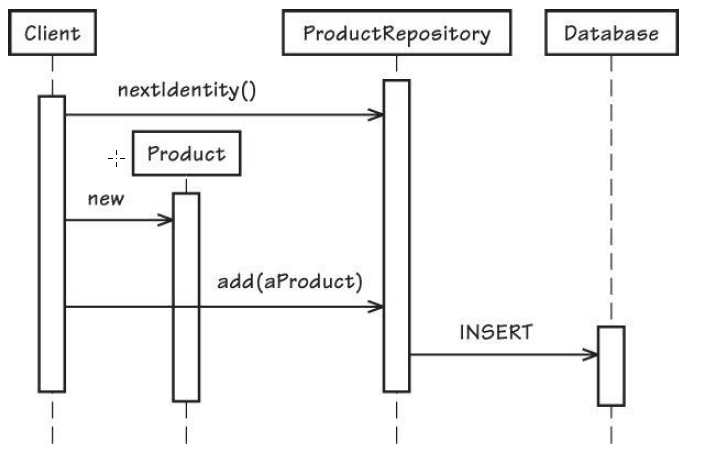

# Chapter 5 Entities

There is a tendency for developers to focus on data rather than the domain. We might think primarily 
about the attributes (columns) and associations (foreign keys) of the data. Doing so reflects the data model into 
object counterparts, which leads to almost every concept in our “domain model” being coded as an Entity 
abounding with getter and setter methods.That’s not the only behavior DDD Entities should have.


## Chapter Learning content
* Consider why Entities have their proper place when we need to model unique things.
* See how unique identities may be generated for Entities.
* Look in on a design session as a team captures its Ubiquitous Language (1) in Entity design.
* Learn how you can express Entity roles and responsibilities.
* See examples of how Entities can be validated and how to persist them to storage.


## Why We Use Entities
We design a domain concept as an Entity when we care about its individuality, 
when distinguishing it from all other objects in a system is a mandatory constraint. An Entity is a unique thing and 
is capable of being changed continuously over a long period of time. Changes may be so extensive that the object might 
seem much different from what it once was. Yet, it is the same object by identity.

It is the unique identity and mutability characteristics that set Entities apart from Value Objects (6).

Businesses regularly put too much effort into developing glorified database table editors. 
Without the correct tool selection, CRUD-based solutions treated elaborately are too expensive. 
When CRUD makes sense, languages and frameworks such as Groovy and Grails, Ruby on Rails, 
and the like make the most sense. If the choice is correct, it should save time and money.

## Unique Identity

Rather than focusing on the attributes or even the behavior, strip the Entity object’s definition down to the 
most intrinsic characteristics, particularly those that identify it or are commonly used to find or match it. 
Add only behavior that is essential to the concept and attributes that are required by that behavior. [Evans, p. 93]

The identity can be practical to find the entity. It depends on how human readable it is.

Identity creation strategies:
* Identity as user input. Application must ensure the uniqueness
* Application generates it internally
* Application uses a persistence store to generate it
* Another Bounded Context hat determined the unique identity.

### user provides identity

complications with this approach:
* Relying users to produce quality identities
* Identity should be immutable so no change after creation

How to handle this issues?

You need to offer fail-proof approaches to enable users to define unique identity. 
It takes extra time and effort to create and approve an identity that will be used pervasively throughout the business.


### Application Generates Identity
The UUID (universally unique identifier) or GUID (globally unique identifier) ar approaches. Other ways could be:
* Time in milliseconds on the computing node
* IP address of the computing code
* Object identity of the factory object instance within the virtual machine (Java)
* Random number generated by the same generator within the virtual machine (Java)

The identity is big and not human readable. 

Random number generator:

```java
public interface RandomNumber {
    
    public void randomNumber() {
        String rawId = java.util.UUID.randomUUID().toString();
    }

    public void withEncryption1() {
        String rawId = java.util.UUID.nameUUIDFromBytes(
                    "Some text".getBytes()).toString();
    }


    public void withEncryption2() {
        SecureRandom randomGenerator = new SecureRandom();
        int randomNumber = randomGenerator.nextInt();
        String randomDigits = new Integer(randomNumber).toString();
        MessageDigest encryptor = MessageDigest.getInstance("SHA-1");
        byte[] rawIdBytes = encryptor.digest(randomDigits.getBytes());
    }
}
```
UUID is a relatively fast identity to generate, requiring no interaction with the outside, such as a p
ersistence mechanism. Even if a specific kind of Entity is created many times per second, the UUID generator 
can keep up the pace. For higher-performance domains we can cache any number of UUID instances, refilling the 
cache in the background. 

We dont want to display a UUID on user interface view:

f36ab21c-67dc-5274-c642-1de2f4d5e72a

A full uuid is appropriate when it can be hidden from users. You should use hypermedia resources with URIs for the users.

Consider a contrived example: APM-P-08-14-2012-F36AB21C. This 25-character identity represents a Product (P) 
from the Agile Project Management Context (APM) that was created on August 14, 2012. The extra text F36AB21C 
is the first segment of a generated UUID, which uniquely sets it apart from other Product Entities created on the same day. 
It has the benefit of human readability with a high probability for global uniqueness.

Representation in code:
```java
public class Product extends Entity {
    private ProductId productId;
    public Date creationDate() {
        return this.productId().creationDate();
    }
}
```


### Persistence Mechanism Generates Identity
If we call on the database for a sequence or incrementing value, it will always be unique.
One possible downside is performance. It can take significantly longer to go to the database to get each value 
than to generate identities in the application. You can use caches to improve this.

Examples for Oracle Sequences and MYSql auto increment columns were provided.

**Order May Matter**

*Early identity* generation and assignment happen before the Entity is
persisted.

*Late identity* generation and assignment happen when the Entity is
persisted.

### Another Bounded Context Assigns Identity
When another Bounded Context assigns identity, we need to integrate to
find, match, and assign each identity. Integrations are explained in Context Maps and Integrating Bounded Countexts.

Making an exact match is the most desirable. Users need to provide one or
more attributes, such as an account number, username, e-mail address, or
other unique symbol, to pinpoint the intended result.

There are some synchronization issues:
* What happens if externally referenced objects transition in ways that affect local Entities?
* How will we know that the associated object changed?

This problem can be solved using an Event-Driven Architecture (4) with Domain Events (8).
This is the most complex of identity creation strategies. The maintenance
of the local Entity is dependent not only on transitions caused by local domain
behaviors but possibly also on those that occur in one or more external
systems. Use this approach as conservatively as possible.


### When the Timing of Identity Generation Matters
Simple case:
Tolerate late allocation of identity.


Consider a scenario where the client subscribes
to outgoing Domain Events. An Event occurs when a new Product
instantiation completes. The client saves the published Event to an Event
Store (8). Eventually those stored Events are published as notifications that
reach subscribers outside the Bounded Context. Using the approach of Figure
5.3, the Domain Event is received before the client has the opportunity to add
the new Product to the ProductRepository. Thus, the Domain Event would
not contain the valid identity of the new Product. For the Domain Event to be
correctly initialized, the identity generation must be completed early. Figure
5.4 demonstrates that approach. The client queries for the next identity from
the ProductRepository, passing it to the Product constructor.




### Surrogate Identity
Some ORM tools, such as Hibernate, want to deal with object identity on their own terms. Hibernate prefers the database’s native type, such as a
numeric sequence, as the primary identity of each Entity. If the domain requires another kind of identity, it causes an undesirable conflict for
Hibernate.
We need two identities. One of the identities is designed for the domain model and adheres to the requirements of the
domain. The other is for Hibernate and is known as a surrogate identity.

Now it is explained how to create a surrogate identity in hibernate ...

### Identity Stability
In most cases unique identity must be protected from modification, remaining stable throughout the lifetime of the Entity to which it is assigned.
some things to do to prevent modification:
* hide identity setters from clients
* create guards in setters to prevent from changing if it exists

example guard:
```java
public class User extends Entity {
    protected void setUsername(String aUsername) {
        if (this.username != null) {
            throw new IllegalStateException(“The username may not be changed.”);
        }
        if (aUsername == null) {
            throw new IllegalArgumentException(“The username may not be set to null.”);
        }
        this.username = aUsername;
    }
}
```

Whiteboard Time:

* Consider some true Entities from your current domain and write
  their names. (What are their unique identities, both domain and surrogate? Would any
                of the identities have been better served by a different kind of identity
                generation, or the timing of the identity assignment?)
* Indicate next to each Entity whether you should have used a
  different identity assignment approach—user, application,
  persistence, or other Bounded Context—and why (even if you can’t
  change it now).
* Note next to each Entity whether it needs early identity generation
  or can suffice with late identity generation, and explain why. Consider the stability of each identity, 
  which is one area you can improve on if necessary
  

## Discovering Entities and Their Intrinsic Characteristics
      
Example CollabOvation team (Scrum context). Team caught in the trap of doing a lot of entityrelationship (ER) modeling in Java code.
This leads to a largely [Anemic Domain Model](https://martinfowler.com/bliki/AnemicDomainModel.html)                                      
The Ubiquitous Language in a cleanly separated Bounded Context gives us
the concepts and terms we need to design our domain model.
Take time to discover your model. Yet, it would be a further mistake to think of the Language as
the glossary and scenarios only. In the end the Language is modeled by your code, and it may be difficult or 
impossible to keep documentation in sync.

### Uncovering Entities and Properties

Identity and Access Context


We need to model a User. Knowledge about the a User:
* Users exist in association with and under the control of a tenancy.
* Users of a system must be authenticated.
* Users possess personal information, including a name and contact information.
* User personal information may be changed by the users themselves or by a manager.
* User security credentials (passwords) may be changed.

As soon as they saw/heard different forms of the word change used, they were pretty sure that they were dealing with at least one Entity.

The key term was authenticated, which was a strong
indication to the team that some kind of search resolution needed to be
provided. If you have a bunch of things, and one of the things needs to be found out of many, you need unique identity to distinguish the one
from all others.

Ideas about the first sentence:
tenants own users: *but they don’t collect and contain them.*
* Tenants allow for the registration of many users by invitation.
* Tenants may be active or be deactivated.
* Users of a system must be authenticated but can be authenticated only if the tenant is active.

Whatever owns users, some users may be unavailable under specific circumstances. It is the beginning of a glossar.

The team decided that they would use a full UUID to identify each
Tenant uniquely, a case where the application generates the identity. By defining a TenantId Value Object, the team could
more confidently ensure that all subscriber-owned Entities were striped with the correct identity.


Continue to find more attributes for the entity. Other attributes may be associated with each subscriber, such as a
support contract and call activation PIN, billing and payment information, and maybe a business location along with customer
contacts. But those are business concerns, not part of security.
                                                 
Glossary:

* Tenant: A named organizational subscriber of identity and access services, as well as other online services. Facilitates user
registration through invitation.
* User: A registered security principal within a tenancy, complete with personal name and contact information. The User has a unique
username and an encrypted password.
* Encryption Service: Provides a means to encrypt passwords and other data that cannot be stored and used as clear text.

*Tenants may be active or be deactivated.*

**Wrong:**

```java
public class Tenant extends Entity {
    private boolean active;
    public void setActive(boolean active) {
        this.active = active;
    }
}
```

**Wright:**

```java
public class Tenant extends Entity {
    public void activate() {
    }
    public void deactivate() {
    }
}
```

The glossary grows:
* Activate tenant: Facilitate the activation of a tenant using this operation, and the current state may be confirmed.
* Deactivate tenant: Facilitate the deactivation of a tenant using this operation. Users may not be authenticated when the tenant is
deactivated.
* Authentication Service: Coordinates the authentication of users, first ensuring that their owning tenant is active.

User along with Fundamental Identity, two commonly combined
security patterns, were applied.1 From the use of the term personal, it is
clear that a personal concept accompanies the User. Person is modeled as a separate class to avoid placing too much
responsibility on the User. The word personal led the team to add Person to the Ubiquitous Language:

* Person: Contains and manages personal data about a User,
  including name and contact information.
  
  


### Roles and Responsibilities
Discover the roles and responsibilities of objects. Here we look specifically at the roles and responsibilities of Entities.
